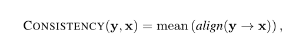
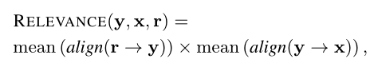
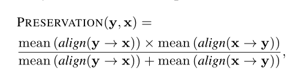
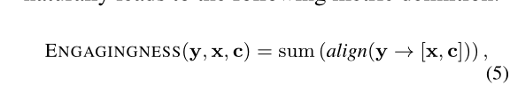
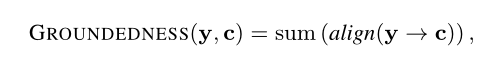

# Compression, Transduction, and Creation: A Unified Framework for Evaluating Natural Language Generation

## 1. url and bib
https://arxiv.org/abs/2109.06379

```bibtex
@misc{2021Compression,
  doi = {10.48550/ARXIV.2109.06379},
  url = {https://arxiv.org/abs/2109.06379},
  author = {Deng, Mingkai and Tan, Bowen and Liu, Zhengzhong and Xing, Eric P. and Hu, Zhiting},
  title = {Compression, Transduction, and Creation: A Unified Framework for Evaluating Natural Language Generation},  
  publisher = {arXiv},
  year = {2021},  
  copyright = {arXiv.org perpetual, non-exclusive license}
}
```

## 2. Three Categories

### Compression
output should **only contain** content from the input, and the included content should be **salient**
### Transaction (传导)
the output must **preserve** the input content precisely (for example, style transfer)
### Creation

generate the output that adds on top of input **new information**

## 3. Pre-defination

- Information Alignment:  

  ​	align(a → b) = <$α_1$, $α_2$, . . . , $α_N$>

  ​		a -> a piece of text with *N* length

  ​		b->  arbitrary data


## 4. Evaluation of Compression Tasks
 x denotes document | y denotes summarization
- **Consistency**




 r denotes the 'importance' of information

- **Relevance**




## 5. Evaluation of Tansduction Tasks
for example, style transfer

- **Preservation**



## 6. Evaluation of Creation Tasks

- **Engagingness**

  

  ​

  y denotes generated text

  x denotes history conversation and c denotes knowledge context (e.g. external documents, a set of facts)  

- **Groundness**




(?)